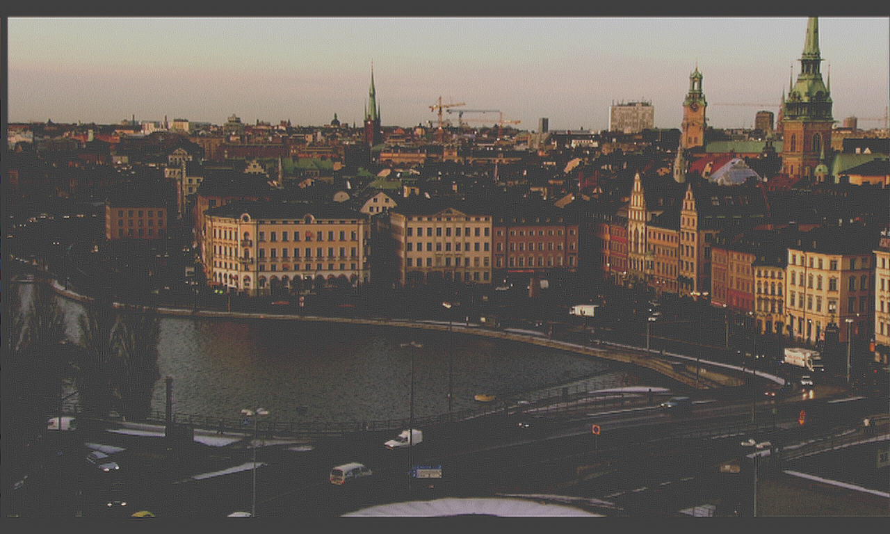

# Visual evaluation of the effects of quantization 

El script implementado (*quantization_image.py*) se encarga de cuantificar una imagen con el coeficiente de cuantificación
pasado por parámetro.

Internamente el script llama al módulo importado *quantizator* (*src/old_mcdwt/transform2/quantizator.py*)
utilizandolo para dividir la imagen de entrada entre el coeficiente (output = frame/coef) y posteriormente utilizandolo 
para realizar el proceso contrario (output = frame*coef).

## Ejemplo de uso:

 *python3 quantization_image.py -i /tmp/inputImage.png -c 2 -o /tmp/inputImage.png*

* **python3** Es la versión de python utilizada.
* **-i** Es la ruta de la imagen a cuantificar.
* **-c** Es el valor del coeficiente de cuantificación.
* **-o** Es la ruta de salida de la imagen cuantificada.

## Ejecución del experimento

La ejecución de comandos para realizar el experimento ha sido el siguiente:

1. Se copian las secuencias de imágenes sobre las que se trabajara a */tmp*

  -  yes | cp ../sequences/stockholm/*.png /tmp  
 
2. Se realiza la transformada directa MDWT:  

  - python3 -O MDWT.py -p /tmp/  
 
3. Se realiza la transformada directa MCDWT:  

  - python3 -O MCDWT.py -p /tmp/  
 
4. Se eliminan las imágenes de la secuencia original 

  - rm /tmp/00?.png

5. Se cuantifican las subbandas:

  - En la primera prueba solo las H:

    - for i in /tmp/H????.png; do python3 ../tools/quantization_image.py -i $i -c 2 -o $i; done;

  - En la segunda prueba incluimos las L:

    - for i in /tmp/L????.png; do python3 ../tools/quantization_image.py -i $i -c 2 -o $i; done;

**Nota:** Al revisar estas capas hemos observado que se ha generado demasiado ruido,
posiblemente debido al rango dinámico de la imagenes.

| | |
|:--:| :--:| 
| *Subbanda HL cuantificada*|*Subbanda LL cuantificada*|

 6.  Se realiza la transformada inversa MCDWT:  

  - python3 -O MCDWT.py -b -p /tmp/  
 
 7. Se realiza la transformada inversa MDWT:  

  - python3 -O MDWT.py -b -p /tmp/  
 
8. Se visualiza la reconstrucción:  

  - for i in /tmp/???.png; do python3 ../tools/substract_offset.py -i $i -o $i.png; done; animate /tmp/???.png.png
  
  ## Conlusiones

En el caso de cuantificar únicamente las subbandas H la imagen es aun distinguible a pesar del ruido, esto es debido a que 
la mayoria de la información de la imagen se encuentra en la subbanda LL.

| | |
|:--:| :--:| 
| *Imágen original*|*Imágen reconstruida trás cuantificar subbandas H*|

En el segundo caso la imagen es completamente indistinguible, el modificar los valores de la subbanda LL 
además puede provocar que fallen las predicciones debido a que esta contiene la información de movimiento.

| | |
|:--:| :--:| 
| *Imágen original*|*Imágen reconstruida trás cuantificar todas las subbandas*|

Hemos realizado pruebas con imagenes a las que no se habia modificado el rango dinámico y el resultado de cuantificar en esta
ocasión producia imagenes más oscuras al realizar la división y una imagen similar a la original cuando se descuantificaba 
realizando la multiplicación.

| | ||
|:--:| :--:| :--:|  
| *Imágen original*|*Fase I de cuantificación (División)*| *Fase II de cuantificación (Multiplicación)*|

